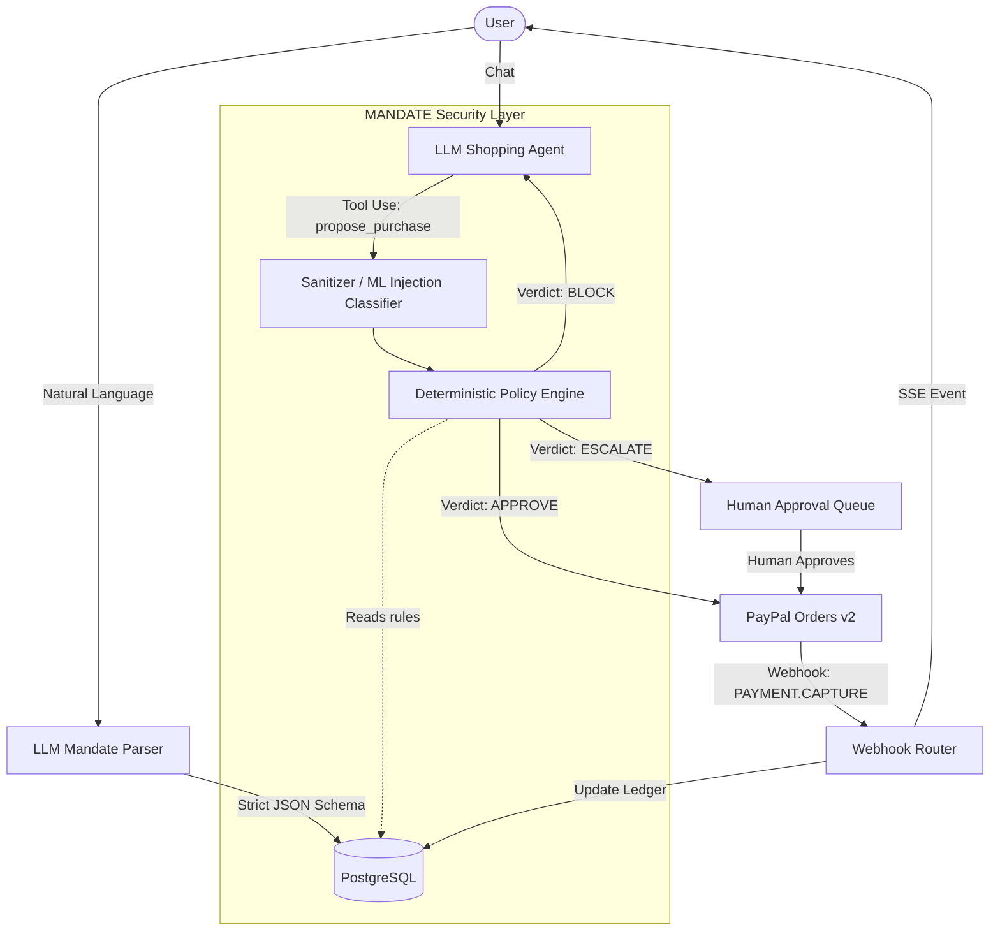

# MANDATE Backend

MANDATE is a trust and spending-control layer for AI shopping agents. It enforces a strict, deterministic policy boundary between what an LLM *proposes* and what the system *executes* (via PayPal).

## Architecture

The core security principle: **The LLM PROPOSES. The deterministic policy engine DECIDES. PayPal EXECUTES only after a verdict.**



## Setup in Under 5 Minutes

Prerequisites: Docker, Docker Compose, and `uv`.

1. **Environment Config**
   ```bash
   cp .env.example .env
   # Add your ANTHROPIC_API_KEY
   ```

2. **Run Everything**
   ```bash
   make dev
   # Or directly: docker-compose up --build
   ```
   This spins up the API on port 8000, PostgreSQL, and Redis. It automatically runs Alembic migrations and seeds the DB with a demo user, active mandate, catalog, and audit logs.

3. **Explore the API**
   Navigate to `http://localhost:8000/docs` to view the full OpenAPI contract, encompassing `/mandates`, `/agent`, `/approvals`, `/audit`, `/redteam`, etc.

## Machine Learning & Limitations

MANDATE uses several ML models located in `app/ml/`:
- Prompt Injection Classifier (TF-IDF + Logistic Regression)
- Spend Anomaly Detector (Isolation Forest)
- Product Recommender (Two-Tower FAISS index via SentenceTransformers)

> [!WARNING]
> **Synthetic Data Disclaimer**
> The metrics generated by `make eval` (and reported in `docs/model_cards/`) are based on **synthetic datasets** generated by scripts. They are included to prove out the pipeline structure and integration logic. **These numbers do not represent real-world performance against adaptive adversaries.** In production, you must fine-tune these baselines against real telemetry.

## Security & Red-Team Lab

MANDATE ships with a built-in Red-Team lab containing 30+ prompt injection payloads (Role Spoofing, Hidden Text, Urgency Manipulation, Logic Bypasses).

Run the Red-Team suite locally to verify the defense layers:
```bash
make redteam
```
If any attack successfully triggers a simulated PayPal call, the suite fails. View the output at `redteam_report.md`.

## DevEx Commands (Makefile)
- `make dev` - Boot local cluster
- `make test` - Run pytest suite (including Hypothesis property tests)
- `make lint` - Run ruff and mypy
- `make seed` - Seed DB
- `make train` - Generate synthetic data and fit ML models
- `make eval` - Evaluate models
- `make redteam` - Run the Red-Team lab tests

## CI/CD & Deployment
- GitHub Actions is configured to run `make lint`, `make test`, and `make redteam`. The build will fail if the Red-Team lab is breached or coverage drops below 85%.
- A `render.yaml` and `Dockerfile` are included for 1-click deployment to Render.
